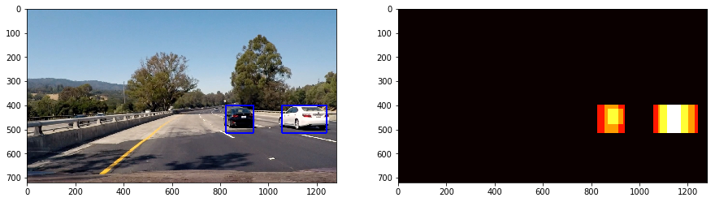

# Vehicle Detection

The goals / steps of this project are the following:

- Perform a Histogram of Oriented Gradients (HOG) feature extraction on a labeled training set of images and train a classifier Linear SVM classifier
- Optionally, you can also apply a color transform and append binned color features, as well as histograms of color, to your HOG feature vector.
- Implement a sliding-window technique and use your trained classifier to search for vehicles in images.
- Run your pipeline on a video stream (start with the test_video.mp4 and later implement on full project_video.mp4) and create a heat map of recurring detections frame by frame to reject outliers and follow detected vehicles.
- Estimate a bounding box for vehicles detected.

### Code overview

There are two main files containing the source code for this project:
- train.ipynb: contains the training procedure and evaluation metrics
- classify.ipynb: contains the sliding window implementation, actuall classification and video processing.
- lessons_functions.py: contains handy functions from the labs
- output_images/output.gif: contains the processed video

### Features For Classification 

This paragraph describes the features, which were extracted from images in order to train a classifier.

#### Histogram Of Oriented Gradients (HOG)

The histogram is calculated for each channel of YCrCb image. I did several experiments in order to choose the best values for the HOG parameters. Increasing the amount of pixels_per_cell, or cells_per_block reduces the granulity of information carried by this feature. On the other hand, when decreased too much, it stops bringing information about spatial structure of the image. The set of parameters chosen for the projects is listened in the table below. This classifier only gives accuracy of around 98%.

<table>
<tr>
<th>pixels_per_cell</th>
<th>cells_per_block</th>
<th>orientations</th>
</tr>
<tr>
<td>8</td>
<td>2</td>
<td>9</td>
</tr>
</table>

#### Spatial information

So called "spatial information" is a resized image (16x16), which is then converted to a single row representation. In this way I can't really benefit of the spatial information, as I'd normally do, if I used Convolutional Neural Networks, but for the purpose of this exercise I stayed stick to this approach. Using only spatial information, would give me accuracy of ~ 98% using SVM classifier described below.

#### Color histograms

This feature contains a combined histogram of each channel of YCrCb image. The histogram is normalized and contains 32 bins. The color histograms only gives the accuracy of around 95%.

#### Combined features
Combining all above features brings the classification accuracy of 99.3% on the validation set. The features were normalized to have zero mean and unit variance using sklearn StandardScaler. Please check the paragraph below for more details.

### Classification

The training set is constructed from images containing both positive and negative examples (cars/no-cars). For each image, the features described in the previous paragraph are extracted. The initial set contains 17760 examples, 2/3 of them are taken as training set, 1/3 is left as a validation set. The classifier is SVM with rbf kernel. 

Below is the confusion matrix calculated for the validation set. As we can see, there was 2974 no-vehicle images, and 2968 of them were predicted correctly. There was also 2887 vehicle-images, and 2855 were predicted correctly. Recall and precision are near 1.0, which means the classifier offers a decent performance.

### Sliding Window Search

In order to find cars on the actual road images, I have implemented a multi-scale sliding window approach. An arbitrary size window is moved through the image, and for each window's position, the features are extracted and then passed to the classifer, which assigns labels to the given area. The labels are obviously 'car' and 'no-car'. This steps are repeated for multiple window-sizes.

An naive approach would be to scan the whole image, with windows of different scales. It wouldn't be particulary effective. Further objects are smaller and expected to appear near the line of horizon. On the other hand, closer objects appear bigger. This common sense assumptions are implemented in the sliding window search procedure - I can scan the area near horizon with small windows, and the closer areas with bigger windows.

The image above explains this idea - each color represents different windows scale and their overlapping areas. Defining sliding windows in this way also greately reduces the amount of potential false-positives, as it ensures, that small objects may appear only in given region. 

Another method helping in solving the false-positives issue is to use a heatmap technique. In simple words, the positive detections from overlapping windows are summed, and then I consider only areas with a value, which is above an arbitrary defined threshold.

This concept is explained on the above image, where lighter color indicates a higher score.

### Video Implementation

Below you may find a video presenting the result, which was obtained by combining a sliding window with SVM classifier.

To make the algorithm more robust and improve performance, there were few modifications made. Firstly, the video was recorded in 25FPS - there is no need to process every frame,  if we assume the car travels with speed of 100km/h. It would mean it passes about 28 meters per second. Hence, the distance passed between two consecutives frames is only about 1.12 meters. Therefore, I consider only every third frame, when the car moves for 3.3 meters and this detections is propagated for the frames in between. 

Secondly, the detections are stored in a memory of an arbitrary size (in this case the size is 3) and then the heatmap approach is taken, as described above.

### Discussion

The biggest deal in the present approach is the performance/accuracy trade off. If improved the performance, in example by increasing the "slide" of the sliding windows, the accuracy would decrease. On the other hand, If used small, constant size sliding window, I'd get a great accuracy but super slow algorithm.

Finding the right balance between performance/accuracy with the current approach, would be a long and painfull process. I'd rather suggest to take a look at the ways of using GPU to make the algorithm parallel, or even better, take a look at the state of the art approaches.

One of the best known solutions for object detection is YOLO (You Look Only Once), which applies convolutional neural network trained to predict bouding boxes directly from an image. It also makes a great use of GPU. Other neural network architectures, like U-net, or SegNet could be also considered.
